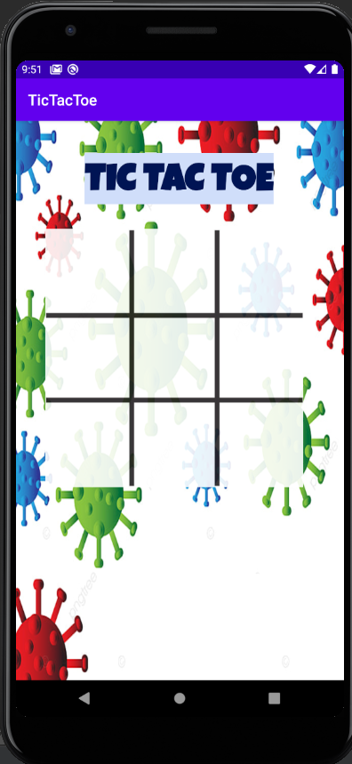
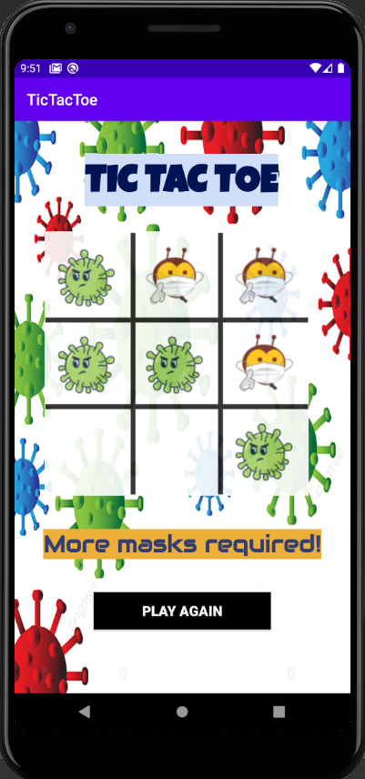
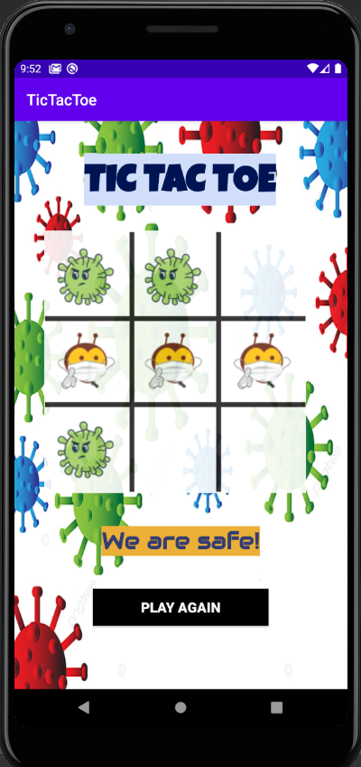
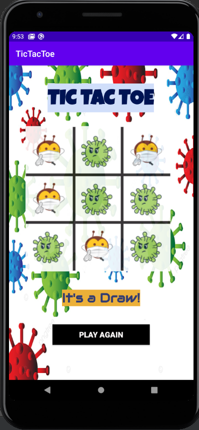

# Connect-3
Connect-3 - A fun game application, built while learning App Development, having exciting animations using concepts of Object Oriented Programming in Java and by using platform like Android Studio, having a light message regarding the ongoing covid scenario about the usage of face-masks through fun animations.

 &nbsp; &nbsp;   
 &nbsp; &nbsp;  
